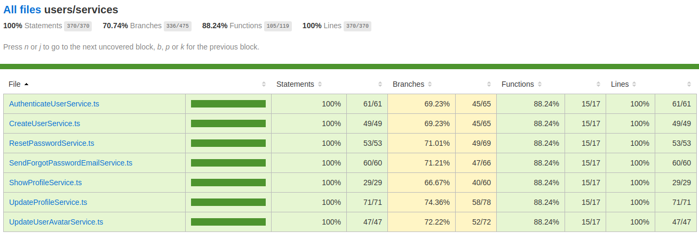
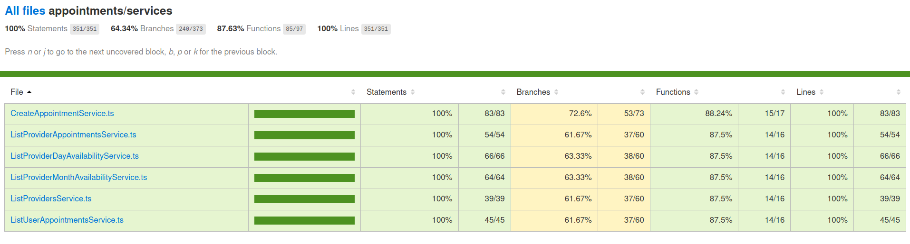

<div align="center">
	<h1>GoBarber API 💈</h1>
</div>

GoBarber API to manage barbershop scheduling, developed copying the instructor coding during the [Rocketseat's](https://rocketseat.com.br) GoStack Course.

## 📝 Features

### Public endpoints

<details>
  <summary>
    Authentication
  </summary>

  ``` json
  {
    "post": "/sessions",
    "request": {
      "headers": {
        "Content-Type": "application/json"
      },
      "data": {
        "email": "string",
        "password": "string"
      }
    },
    "response": {
      "200": {
        "user": {
          "id": "string",
          "name": "string",
          "email": "string",
          "avatar": "string",
          "created_at": "Timestamp ISO-8601",
          "updated_at": "Timestamp ISO-8601",
          "avatar_url": "string"
        },
        "token": "string"
      }
    }
  }
  ```
</details>

<details>
  <summary>
    Create user
  </summary>

  ``` json
  {
    "post": "/users",
    "request": {
      "headers": {
        "Content-Type": "application/json"
      },
      "data": {
        "name": "string",
        "email": "string",
        "password": "string"
      }
    },
    "response": {
      "200": {
        "id": "string",
        "name": "string",
        "email": "string",
        "created_at": "Timestamp ISO-8601",
        "updated_at": "Timestamp ISO-8601",
        "avatar_url": null
      }
    }
  }
  ```
</details>

<details>
  <summary>
    Start the password recovery process
  </summary>

  ``` json
  {
    "post": "/passwords/forgot",
    "request": {
      "headers": {
        "Content-Type": "application/json"
      },
      "data": {
        "email": "string"
      }
    },
    "response": {
      "204": {}
    }
  }
  ```
</details>

<details>
  <summary>
    Create new password
  </summary>

  ``` json
  {
    "post": "/passwords/reset",
    "request": {
      "headers": {
        "Content-Type": "application/json"
      },
      "data": {
        "token": "string",
        "password": "string",
        "password_confirmation": "string"
      }
    },
    "response": {
      "204": {}
    }
  }
  ```
</details>

### Protected endpoints

<details>
  <summary>
    Update the user avatar image
  </summary>

  ``` json
  {
    "patch": "/users/avatar",
    "request": {
      "headers": {
        "Authorization": "Bearer <token>",
        "Content-Type": "multipart/form-data"
      },
      "data": {
        "avatar": "file",
      }
    },
    "response": {
      "200": {
        "id": "string",
        "name": "string",
        "email": "string",
        "avatar": "string",
        "created_at": "Timestamp ISO-8601",
        "updated_at": "Timestamp ISO-8601",
        "avatar_url": "string"
      }
    }
  }
  ```
</details>

<details>
  <summary>
    Get the user profile
  </summary>

  ``` json
  {
    "get": "/profile",
    "request": {
      "headers": {
        "Authorization": "Bearer <token>"
      },
    },
    "response": {
      "200": {
        "id": "string",
        "name": "string",
        "email": "string",
        "avatar": "string",
        "created_at": "Timestamp ISO-8601",
        "updated_at": "Timestamp ISO-8601",
        "avatar_url": "string"
      }
    }
  }
  ```
</details>

<details>
  <summary>
    Get provider appointments of a day
  </summary>

  ``` json
  {
    "get": "/appointments/provider/me",
    "request": {
      "headers": {
        "Authorization": "Bearer <token>",
        "Content-Type": "application/json"
      },
      "data": {
        "year": "integer",
        "month": "integer",
        "day": "integer"
      }
    },
    "response": {
      "200": [
        {
          "id": "string",
          "provider_id": "string",
          "user_id": "string",
          "date": "Timestamp ISO-8601",
          "created_at": "Timestamp ISO-8601",
          "updated_at": "Timestamp ISO-8601",
          "user": {
            "id": "string",
            "name": "string",
            "email": "string",
            "avatar": "string",
            "created_at": "Timestamp ISO-8601",
            "updated_at": "Timestamp ISO-8601",
            "avatar_url": "string"
          }
        }
      ]
    }
  }
  ```
</details>

<details>
  <summary>
    Get user appointments
  </summary>

  ``` json
  {
    "get": "/appointments/user/me",
    "request": {
      "headers": {
        "Authorization": "Bearer <token>",
        "Content-Type": "application/json"
      },
    },
    "response": {
      "200": [
        {
          "id": "string",
          "provider_id": "string",
          "user_id": "string",
          "date": "Timestamp ISO-8601",
          "created_at": "Timestamp ISO-8601",
          "updated_at": "Timestamp ISO-8601",
          "provider": {
            "id": "string",
            "name": "string",
            "email": "string",
            "avatar": "string",
            "created_at": "Timestamp ISO-8601",
            "updated_at": "Timestamp ISO-8601",
            "avatar_url": "string"
          }
        }
      ]
    }
  }
  ```
</details>

<details>
  <summary>
    Create an appointment
  </summary>

  ``` json
  {
    "post": "/appointments",
    "request": {
      "headers": {
        "Authorization": "Bearer <token>",
        "Content-Type": "application/json"
      },
      "data": {
        "provider_id": "string",
        "date": "Timestamp ISO-8601"
      }
    },
    "response": {
      "200": {
        "id": "string",
        "provider_id": "string",
        "user_id": "string",
        "date": "Timestamp ISO-8601",
        "created_at": "Timestamp ISO-8601",
        "updated_at": "Timestamp ISO-8601"
      }
    }
  }
  ```
</details>

<details>
  <summary>
    Get all providers except the own user
  </summary>

  ``` json
  {
    "get": "/providers",
    "request": {
      "headers": {
        "Authorization": "Bearer <token>",
      }
    },
    "response": {
      "200": [
        {
          "id": "string",
          "name": "string",
          "email": "string",
          "avatar": "string",
          "created_at": "Timestamp ISO-8601",
          "updated_at": "Timestamp ISO-8601",
          "avatar_url": "string"
        }
      ]
    }
  }
  ```
</details>

<details>
  <summary>
    Get the provider availability in each day of a month
  </summary>

  ``` json
  {
    "get": "/providers/:id/month-availability",
    "request": {
      "headers": {
        "Authorization": "Bearer <token>",
        "Content-Type": "application/json"
      },
      "data": {
        "month": "integer",
        "year": "integer"
      }
    },
    "response": {
      "200": [
        {
          "day": "integer",
          "available": "boolean"
        }
      ]
    }
  }
  ```
</details>

<details>
  <summary>
    Get the provider availability in each hour of a day
  </summary>

  ``` json
  {
    "get": "/providers/:id/day-availability",
    "request": {
      "headers": {
        "Authorization": "Bearer <token>",
        "Content-Type": "application/json"
      },
      "data": {
        "day": "integer",
        "month": "integer",
        "year": "integer"
      }
    },
    "response": {
      "200": [
        {
          "hour": "integer",
          "available": "boolean"
        }
      ]
    }
  }
  ```
</details>

### Response Error

<details>
  <summary>
    Generic error
  </summary>

  ``` json
  {
    "400": {
      "status": "error",
      "message": "string"
    },
  }
  ```
</details>

<details>
  <summary>
    Too many requests
  </summary>

  ``` json
  {
    "429": {
      "status": "error",
      "message": "Too many requests"
    }
  }
  ```
</details>

### Routes
- [Download here](./readme/insomnia.json), and import it in [Insomnia](https://insomnia.rest/)

## 🧰 Main languages and libraries


## 🚀 Publishing

Github Actions is being used to deploy and deliver the applications on Digital Ocean server.

## 🧪 Test Coverage Report (Jest library)

  
  

## ⚙️ Setup

1. Environment:
 - NodeJS: v12.18.0
 - Yarn: v1.22.5

2. Project
```
# clone this repo
$ git clone https://github.com/danielynx/rocketseat-gobarber-api.git

# go to project folder
$ cd rocketseat-gobarber-api

# install dependencies
$ yarn install

# Config the environment variables on .env file

# Start the development environment
$ yarn dev:server
```

## 📖 Main concepts that I learned in this project
  - User authentication using JWT.
  - How connect with Postgres using TypeOrm component.
  - How structure applications follow some SOLID principles.
  - Learned that Drive Domain Development (DDD) define that the application's folders, files and class must be separated into modules according to the domain that the application cover.
  - Refactored the application to apply the Dependency Inversion principle.
  - Control the dependency injection with the Tsyringe library.
  - How to use Jest Library to make unitary test that validate the business rules, that in turn are isolated into the Service layer.
  - To vendors dependencies it's necessary create a provider module, that isolate the vendor dependency and connect these provider with my application using an interface.
  - Used the Ethereal library to manage email sending on development environment.
  - Created the notification module to stores, into the MongoDB, the messages that need be delivered to users.
  - Created validations to route's body parameters using Celebrate and Joi libraries.
  - Isolated the environment variables using Dotenv library.
  - How expose and exclude entities fields on response using ClassTranform library.
  - Created the mail provider to send mail by AmazonAWS SES.
  - Created the storage provider to upload file to AmazonAWS S3.
  - Created the cache provider that use Redis as cache storage.
  - Using the same Redis as storage, limited the number of requests per second using RateLimiterFlexible library.
  - Create Github actions to build and deploy to the server.
  - Config Nginx and PM2 on DigitalOcean Server to delivery a NodeJS application.
  - Create SSL certification with certbot tools.
