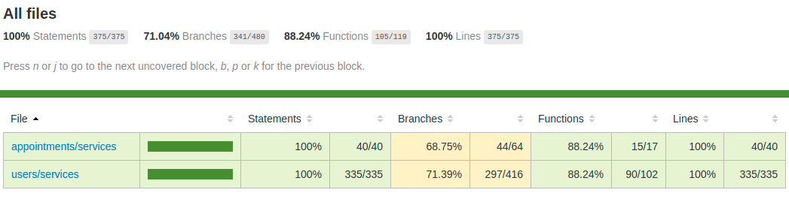
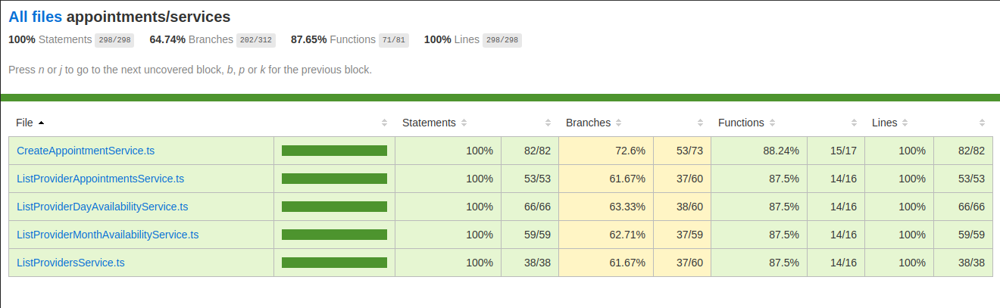

# GoBarber API

Project developed copying the instructor coding during the Rocketseat Bootcamp Course.

This is the API to support a project that will manage barbershop scheduling.

## Test Coverage Report (Jest library)

  
  

## API Documentation

### Authentication

``` json
{
  "post": "/sessions",
  "request": {
    "headers": {
      "Content-Type": "application/json"
    },
    "data": {
      "email": "string",
      "password": "string"
    }
  },
  "response": {
    "200": {
      "user": {
        "id": "string",
        "name": "string",
        "email": "string",
        "avatar": "string",
        "created_at": "Timestamp ISO-8601",
        "updated_at": "Timestamp ISO-8601",
        "avatar_url": "string"
      },
      "token": "string"
    }
  }
}
```

### Public endpoints

``` json
{
  "post": "/users",
  "request": {
    "headers": {
      "Content-Type": "application/json"
    },
    "data": {
      "name": "string",
      "email": "string",
      "password": "string"
    }
  },
  "response": {
    "200": {
      "id": "string",
      "name": "string",
      "email": "string",
      "created_at": "Timestamp ISO-8601",
      "updated_at": "Timestamp ISO-8601",
      "avatar_url": null
    }
  }
}
```
``` json
{
  "post": "/passwords/forgot",
  "request": {
    "headers": {
      "Content-Type": "application/json"
    },
    "data": {
      "email": "string"
    }
  },
  "response": {
    "204": {}
  }
}
```
``` json
{
  "post": "/passwords/reset",
  "request": {
    "headers": {
      "Content-Type": "application/json"
    },
    "data": {
      "token": "string",
      "password": "string",
      "password_confirmation": "string"
    }
  },
  "response": {
    "204": {}
  }
}
```

### Protected endpoints

``` json
{
  "patch": "/users/avatar",
  "request": {
    "headers": {
      "Authorization": "Bearer <token>",
      "Content-Type": "multipart/form-data"
    },
    "data": {
      "avatar": "file",
    }
  },
  "response": {
    "200": {
      "id": "string",
      "name": "string",
      "email": "string",
      "avatar": "string",
      "created_at": "Timestamp ISO-8601",
      "updated_at": "Timestamp ISO-8601",
      "avatar_url": "string"
    }
  }
}
```
``` json
{
  "get": "/profile",
  "request": {
    "headers": {
      "Authorization": "Bearer <token>"
    },
  },
  "response": {
    "200": {
      "id": "string",
      "name": "string",
      "email": "string",
      "avatar": "string",
      "created_at": "Timestamp ISO-8601",
      "updated_at": "Timestamp ISO-8601",
      "avatar_url": "string"
    }
  }
}
```
``` json
{
  "get": "/appointments/me",
  "request": {
    "headers": {
      "Authorization": "Bearer <token>",
      "Content-Type": "application/json"
    },
    "data": {
      "year": "integer",
      "month": "integer",
      "day": "integer"
    }
  },
  "response": {
    "200": [
      {
        "id": "string",
        "provider_id": "string",
        "user_id": "string",
        "date": "Timestamp ISO-8601",
        "created_at": "Timestamp ISO-8601",
        "updated_at": "Timestamp ISO-8601",
        "user": {
          "id": "string",
          "name": "string",
          "email": "string",
          "avatar": "string",
          "created_at": "Timestamp ISO-8601",
          "updated_at": "Timestamp ISO-8601",
          "avatar_url": "string"
        }
      }
    ]
  }
}
```
``` json
{
  "post": "/appointments",
  "request": {
    "headers": {
      "Authorization": "Bearer <token>",
      "Content-Type": "application/json"
    },
    "data": {
      "provider_id": "string",
      "date": "Timestamp ISO-8601"
    }
  },
  "response": {
    "200": {
      "id": "string",
      "provider_id": "string",
      "user_id": "string",
      "date": "Timestamp ISO-8601",
      "created_at": "Timestamp ISO-8601",
      "updated_at": "Timestamp ISO-8601"
    }
  }
}
```
``` json
{
  "get": "/providers",
  "request": {
    "headers": {
      "Authorization": "Bearer <token>",
    }
  },
  "response": {
    "200": [
      {
        "id": "string",
        "name": "string",
        "email": "string",
        "avatar": "string",
        "created_at": "Timestamp ISO-8601",
        "updated_at": "Timestamp ISO-8601",
        "avatar_url": "string"
      }
    ]
  }
}
```
``` json
{
  "get": "/providers/:id/month-availability",
  "request": {
    "headers": {
      "Authorization": "Bearer <token>",
      "Content-Type": "application/json"
    },
    "data": {
      "month": "integer",
      "year": "integer"
    }
  },
  "response": {
    "200": [
      {
        "day": "integer",
        "available": "boolean"
      }
    ]
  }
}
```
``` json
{
  "get": "/providers/:id/day-availability",
  "request": {
    "headers": {
      "Authorization": "Bearer <token>",
      "Content-Type": "application/json"
    },
    "data": {
      "day": "integer",
      "month": "integer",
      "year": "integer"
    }
  },
  "response": {
    "200": [
      {
        "hour": "integer",
        "available": "boolean"
      }
    ]
  }
}
```

### Error response

``` json
{
  "response": {
    "400": {
      "status": "error",
      "message": "string"
    },
    "429": {
      "status": "error",
      "message": "Too many requests"
    }
  }
}
```


## What I learned or did in this project?
  - User authentication using JWT.
  - How connect with Postgres using TypeOrm component.
  - How structure applications follow some SOLID principles.
  - Learned that Drive Domain Development (DDD) define that the application's folders, files and class must be separated into modules according to the domain that the application cover.
  - Refactored the application to apply the Dependency Inversion principle.
  - Control the dependency injection with the Tsyringe library.
  - How to use Jest Library to make unitary test that validate the business rules, that in turn are isolated into the Service layer.
  - To vendors dependencies it's necessary create a provider module, that isolate the vendor dependency and connect these provider with my application using an interface.
  - Used the Ethereal library to manage email sending on development environment.
  - Created the notification module to stores, into the MongoDB, the messages that need be delivered to users.
  - Created validations to route's body parameters using Celebrate and Joi libraries.
  - Isolated the environment variables using Dotenv library.
  - How expose and exclude entities fields on response using ClassTranform library.
  - Created the mail provider to send mail by AmazonAWS SES.
  - Created the storage provider to upload file to AmazonAWS S3.
  - Created the cache provider that use Redis as cache storage.
  - Using the same Redis as storage, limited the number of requests per second using RateLimiterFlexible library.
